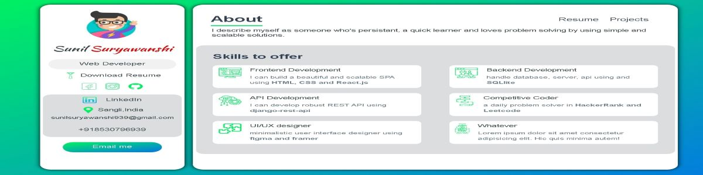
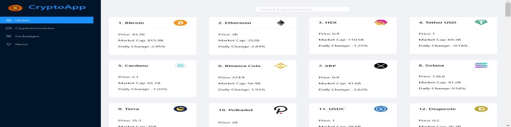
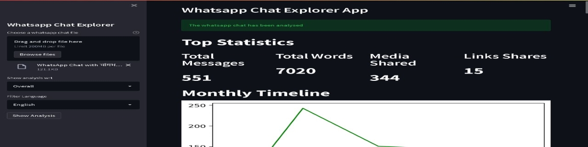

<!-- {:target="_blank"}  -->

<h1 align="center">Hi 👋, I'm Sunil Suryawanshi</h1>
<h3 align="right">A passionate web developer from India</h3>

<h1 align="center">Personal projects</h2>
<h2>Portfolio Website : 
 <h4> <a href="https://github.com/sunilsuryawanshi939/My_Portfolio" target="_blank"> Github Repo </a> </h4>
 <h4> <a href="https://suryawanshi.tech" target="_blank"> Deployed here </a> </h4> 

  </h2> 

<h2>Crypto App :
 <h4> <a href="https://github.com/sunilsuryawanshi939/CryptoApp" target="_blank"> Github Repo </a> </h4> 
  <h4> <a href="https://sunilcryptoapp.netlify.app" target="_blank"> Deployed here  </a> </h4> 

  </h2>  

<h2>Whatsapp Chat Explorer :
 <h4> <a href="https://github.com/sunilsuryawanshi939/WhatsappChatExplorer" target="_blank"> Github Repo </a> </h4>
 <h4> <a href="https://wca-sunil.herokuapp.com" target="_blank"> Deployed here </a> </h4> 

  </h2>  

 
 
 <h2 align="center">Languages and Tools:</h2>

 

 
 

<!--   -->

 <!-- 
  
 -->

 

<!--  -->
